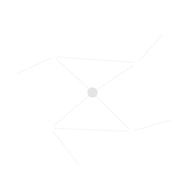
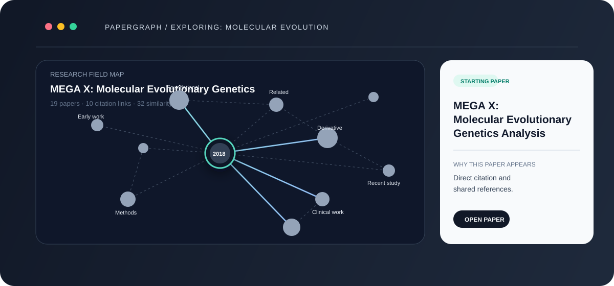
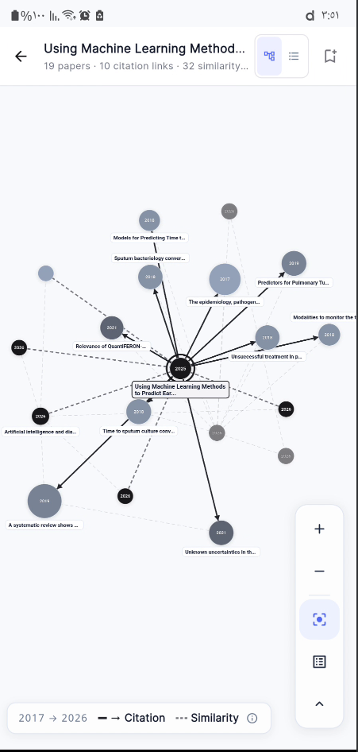
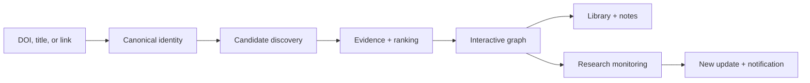

<p align="center">
  
</p>

<h1 align="center">PaperGraph</h1>

<p align="center">
  <strong>See the field.<br />Not just the paper.</strong>
</p>

<p align="center">
  Turn one DOI, title, or paper link into an explorable map of citations,
  related research, and the ideas surrounding a paper.
</p>

<p align="center">
  <a href="#quick-start">Run locally</a> ·
  <a href="#how-it-works">How it works</a> ·
  <a href="#research-integrity">Research integrity</a>
</p>

<p align="center">
  
  
  
  
  
</p>

<br />

<p align="center">
  
</p>

## The idea

Academic search is optimized for retrieval. **Research is not a list. It is a field.**

PaperGraph starts with one paper and helps a researcher understand:

- what came before it;
- what cites it directly;
- what is related through shared scholarly evidence;
- which later work extends the field; and
- what changed after the graph was saved.

It is built to make a research area navigable without pretending that incomplete provider data is complete.

## See it in action

<p align="center">
  
</p>

<p align="center"><em>A graph is useful when it helps you decide what to read next.</em></p>

## From one paper to a research field

<table>
<tr>
<td width="33%" valign="top">

### 01 · Discover

Paste a DOI, title, or paper link. PaperGraph resolves the canonical work and gathers candidate literature from scholarly sources.

</td>
<td width="33%" valign="top">

### 02 · Understand

Explore directional citation paths separately from evidence-backed similarity relationships. Open any node for context.

</td>
<td width="33%" valign="top">

### 03 · Keep going

Save the graph, add notes, export citations, monitor it for new work, and return to it offline.

</td>
</tr>
</table>

## What you can do

### Explore

- Search by title, DOI, keyword, or paper link.
- Generate an interactive literature graph.
- Toggle citation and similarity layers.
- Zoom, pan, recenter, and inspect nodes.
- See publication years, relationship direction, and graph diagnostics.
- Open paper-level details and connected literature.

### Read and keep

- View paper metadata and abstract previews.
- Save papers and graphs to the library.
- Add personal notes.
- Export APA, BibTeX, MLA, and Chicago citations.
- Use cached graphs and saved papers offline.

### Monitor

- Turn research monitoring on for a saved graph.
- Review newly discovered papers and why they appeared.
- Add an update back to the graph.
- Mark updates as read.
- Pause and resume monitoring.
- Receive local and Firebase-backed notifications where configured.

## How it works



### The stack

<p>
  
  
  
  
  
  
  
  
  
  
</p>

| Layer | Technology |
| --- | --- |
| Mobile client | Flutter, Dart, BLoC/Cubit |
| API | FastAPI, Pydantic, Uvicorn |
| Persistence | PostgreSQL, SQLAlchemy, Alembic |
| Local infrastructure | Docker Compose, PostgreSQL, Redis |
| Authentication and notifications | Firebase Auth, Firebase Messaging, local notifications |
| Scholarly sources | Semantic Scholar, OpenAlex, Crossref, PubMed |
| Automation | GitHub Actions, scheduled monitoring workers |
| Deployment | Render |

## Graph semantics

PaperGraph does not flatten every signal into one vague “related” edge.

| Relationship | Meaning | Direction |
| --- | --- | --- |
| **Citation** | A bibliographic relationship where one paper cites another | Directional |
| **Similarity** | Relatedness supported by shared references, co-citation, or validated content signals | Undirected |
| **Unavailable** | The provider did not return enough evidence | No relationship is invented |

> **A similar title is not a citation. A missing score is not a zero.**

The graph preserves those distinctions so the user can explore confidently and still see where the evidence is incomplete.

## Research integrity

PaperGraph depends on external scholarly indexes. Their coverage, indexing delay, quotas, and rate limits affect every graph.

The backend is designed to:

- normalize identities across providers;
- preserve provider identifiers and provenance;
- keep citation and similarity semantics separate;
- expose incomplete evidence instead of manufacturing confidence;
- fall back where possible; and
- return partial results when upstream data is unavailable.

A graph is a discovery aid—not a replacement for reading the original papers or verifying a claim at the source.

## Repository map

```text
.
├── backend/
│   ├── app/api/v1/       # Search, resolve, graph, paper, monitoring routes
│   ├── app/candidates/   # Candidate discovery and retention
│   ├── app/enrichment/   # Metadata, references, citations, metrics
│   ├── app/graph/        # Evidence, ranking, edges, layout, synthesis
│   ├── app/monitoring/   # Research update scanner
│   ├── app/providers/    # Semantic Scholar, OpenAlex, Crossref, PubMed
│   ├── alembic/          # Database migrations
│   ├── scripts/          # Operational and smoke-test scripts
│   └── tests/            # Backend test suite
├── flutter_app/
│   ├── lib/views/        # Explore, graph, paper, library, updates, settings
│   ├── lib/cubits/       # State and async workflows
│   ├── lib/core/         # API, cache, auth, notifications
│   └── test/             # Widget, graph, responsive, and notification tests
├── .github/workflows/    # Monitoring and controlled operational jobs
├── docker-compose.yml    # Local PostgreSQL and Redis
└── render.yaml           # Render deployment definition
```

## Quick start

### Prerequisites

- Flutter SDK compatible with Dart `3.12.2`.
- Python `3.11+`.
- Docker Desktop.
- Provider credentials for live scholarly data.
- Firebase configuration for authentication and notification flows.

### 1. Start local infrastructure

```powershell
docker compose up -d postgres redis
```

### 2. Configure the backend

Create `backend/.env` locally. Never commit it.

```env
DATABASE_URL=postgresql+asyncpg://<user>:<password>@localhost:5432/<database>
SEMANTIC_SCHOLAR_API_KEYS=key1,key2
CROSSREF_MAILTO=your-email@example.com
OPENALEX_MAILTO=your-email@example.com
FIREBASE_PROJECT_ID=your-firebase-project-id
```

Optional configuration includes `NCBI_API_KEY`, SMTP/Resend credentials, Firebase service-account credentials for worker notifications, and provider rate limits.

### 3. Install and run the backend

```powershell
cd backend
python -m venv .venv
.\.venv\Scripts\Activate.ps1
python -m pip install --upgrade pip
python -m pip install -r requirements.txt
python -m alembic upgrade head
python -m uvicorn app.main:app --host 127.0.0.1 --port 8000
```

API docs:

```text
http://127.0.0.1:8000/docs
```

### 4. Run the Flutter client

In another terminal:

```powershell
cd flutter_app
flutter pub get
flutter run --dart-define=PAPERGRAPH_API_URL=http://10.0.2.2:8000/api/v1
```

`10.0.2.2` is the Android emulator alias for the host machine. For a physical device, use the computer's LAN IP.

## Quality gates

### Backend

```powershell
cd backend
.\.venv\Scripts\python.exe -m compileall -q app tests
.\.venv\Scripts\python.exe -m pytest -q
```

### Flutter

```powershell
cd flutter_app
flutter analyze
flutter test
```

The test suites cover graph semantics, ranking, enrichment, monitoring deduplication, authentication policies, notifications, offline behavior, responsive layouts, RTL, and large accessibility text scaling.

## Deployment and automation

`render.yaml` defines the FastAPI web service on Render. GitHub Actions provides scheduled and manually triggered monitoring workflows for due graphs, one-graph scans, and controlled notification navigation tests.

Keep all secrets in Render or GitHub Actions secrets. Never commit:

- provider API keys;
- database URLs;
- Firebase service-account JSON;
- SMTP passwords;
- temporary authentication tokens.

## Current limitations

- External provider quotas can make a graph partial or slow.
- A successful graph does not guarantee complete citation coverage.
- Provider indexing determines which papers can be resolved.
- Firebase configuration and platform permissions are required for the full notification experience.
- The repository does not currently declare an open-source license.

## Roadmap

- Make provider request budgets explicit per graph.
- Improve durable job execution and cancellation for long-running graphs.
- Persist richer evidence and provenance in graph snapshots.
- Add stronger provider-health telemetry and partial-result explanations.
- Continue improving graph layout without weakening relationship semantics.
- Publish a clear license and contribution guide.

## Contributing

Before opening a pull request:

1. Keep credentials and production data out of commits.
2. Add or update tests for behavior changes.
3. Run `flutter analyze` and `flutter test` for client changes.
4. Run `python -m pytest -q` for backend changes.
5. Document migrations and operational changes.
6. Never present incomplete provider data as complete research evidence.

## License

No license has been declared yet. Until a license is added, this repository should not be assumed to grant permission to copy, modify, or redistribute the code.
